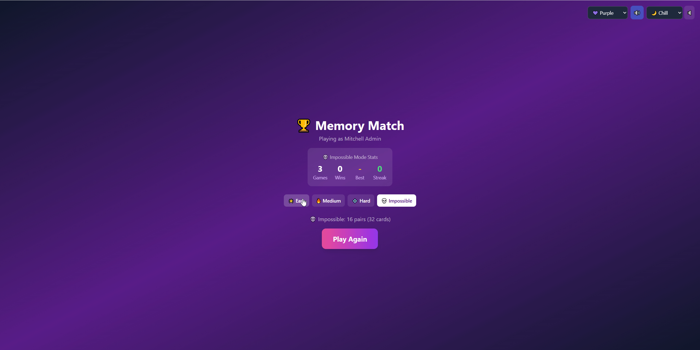

# Memory Match

A card-matching memory game built as an Odoo MCP Studio web application with multiple difficulty modes, per-mode statistics, customizable themes, and procedurally generated background music.

## Features

### Gameplay
- Classic memory matching mechanics - flip cards to find matching pairs
- Smooth card flip animations with visual feedback
- Move counter tracking your efficiency
- Pairs progress indicator
- Victory celebration with win streak tracking

### Game Modes
- **Easy** - 6 pairs (12 cards) in a 4x3 grid
- **Medium** - 8 pairs (16 cards) in a 4x4 grid
- **Hard** - 12 pairs (24 cards) in a 6x4 grid
- **Impossible** - 16 pairs (32 cards) in an 8x4 grid

### Per-Mode Statistics
- Stats tracked separately for each difficulty mode
- Games played, games won, best score (fewest moves), win streak
- Stats persist across sessions via user storage
- Stats panel displays current mode's statistics

### Visual Themes
- **6 background themes:**
  - Purple - Deep violet gradient (default)
  - Ocean - Blue and cyan tones
  - Sunset - Warm orange and red
  - Forest - Lush green shades
  - Midnight - Dark slate grays
  - Cosmic - Vibrant violet and fuchsia
- Theme preference saved automatically

### Audio
- **3 procedurally generated music tracks:**
  - Chill - Slow relaxing sine wave arpeggios
  - Upbeat - Energetic fast-paced chiptune
  - Retro - Classic 8-bit sawtooth waves
- **Sound effects:**
  - Card flip sound
  - Match found celebration
  - No match feedback
  - Victory fanfare
- Separate toggles for music and sound effects
- All audio generated in-browser using Web Audio API (no external files)

### Additional Features
- Responsive card sizing based on difficulty
- User greeting for logged-in players
- Settings bar with quick access to all options
- Back to menu option during gameplay
- Special "LEGENDARY!" victory message for Impossible mode

## Import

1. Download `Memory_Match.csv` from this folder
2. In Odoo, go to **MCP Server > Web Apps** list view
3. Click the **gear icon** (Actions) and select **Import records**
4. Upload the `.csv` file and follow the import wizard

## Requirements

- [Odoo MCP Studio](https://apps.odoo.com/apps/modules/19.0/odoo_remote_mcp)
