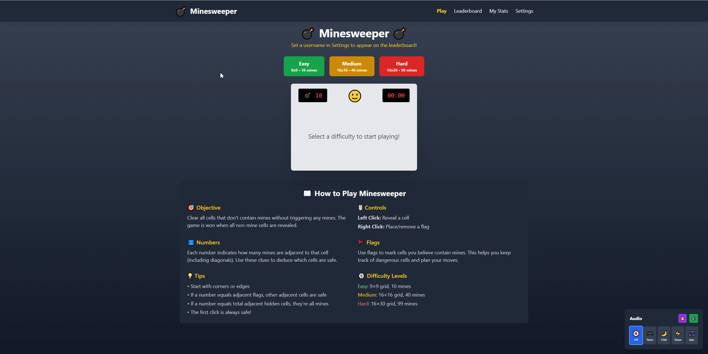

# Minesweeper

A classic Minesweeper game built as an Odoo MCP Studio web application with multiple difficulty levels, global leaderboards, user statistics, and background music.

## Features

### Gameplay
- Classic Minesweeper mechanics with left-click to reveal and right-click to flag
- **Safe first click** - your first click never hits a mine
- **Flood fill reveal** - clicking empty cells automatically reveals adjacent safe cells
- Real-time timer tracking your completion time
- Mine counter showing remaining unflagged mines
- Expressive emoji feedback based on game state

### Difficulty Levels
- **Easy** - 9x9 grid with 10 mines
- **Medium** - 16x16 grid with 40 mines
- **Hard** - 16x30 grid with 99 mines

### Global Leaderboard
- Top 10 fastest completion times for each difficulty level
- **Privacy-focused** - uses custom minesweeper usernames instead of real names
- Auto-refreshing leaderboard page
- Scores submitted automatically on winning

### User Statistics
- Persistent stats saved per user account
- Tracks per difficulty: games played, games won, win rate, best time
- Overall totals and win percentage
- Option to reset all statistics

### Audio
- **4 background music tracks:**
  - Retro - Classic arcade vibes
  - Chill - Relaxing ambient tones
  - Tense - Suspenseful atmosphere
  - Epic - Heroic adventure theme
- Sound effects for clicks, reveals, flag placement, explosions, and victory
- Separate toggles for music and sound effects
- Master mute control

### Additional Features
- Full rules and how-to-play guide displayed below the game
- Floating audio control panel for quick adjustments
- Settings page for username and audio preferences
- Responsive design with clean UI

### Controls
- **Left Click** - Reveal a cell
- **Right Click** - Place or remove a flag

## Import

1. Download `minesweeper.csv` from this folder
2. In Odoo, go to **MCP Server > Web Apps** list view
3. Click the **gear icon** (Actions) and select **Import records**
4. Upload the `.csv` file and follow the import wizard

## Requirements

- [Odoo MCP Studio](https://apps.odoo.com/apps/modules/19.0/odoo_remote_mcp)
