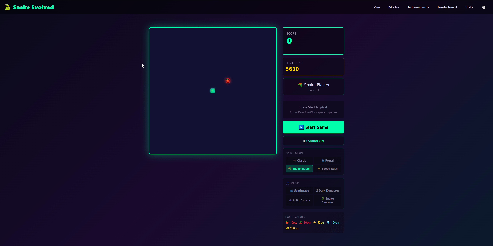

# Snake Evolved

The ultimate Snake game built as an Odoo MCP Studio web application featuring multiple game modes, power-ups, combo system, achievements, themes, music, and a global leaderboard.

## Features

### Game Modes
- **Classic** - Original snake gameplay. Hit a wall or yourself and it's over
- **Portal** - Walls wrap around. Only self-collision kills
- **Snake Blaster** - Your snake auto-fires bullets! Destroy enemy waves. Grow longer for more turrets
- **Speed Rush** - Gets faster with every food eaten. How long can you last?

### Food Types
- **Apple** - 10 points (common)
- **Cherry** - 20 points
- **Star** - 50 points
- **Diamond** - 100 points (rare)
- **Golden Crown** - 200 points (very rare)

### Power-ups
- **Shield** - Survive one wall or self-collision hit
- **Ghost** - Pass through your own body
- **Magnet** - Food spawns nearby
- **Double Points** - 2x points for everything
- **Slow-Mo** - Slows the game down

### Combo System
- Eat food quickly in succession to build combos (up to 10x multiplier)
- Combo text animations and sound effects
- Best combo tracked per game and in lifetime stats

### Snake Blaster Mode
- Wave-based enemy progression with rapid difficulty scaling
- **Drone** - Basic drifting enemies
- **Seeker** - Chases the snake head
- **Tank** - High HP, takes multiple hits
- **Boss** - Massive HP, appears on boss waves
- Body turrets fire side-bullets every 10 segments
- **Freeze** power-up freezes all enemies for 4 seconds
- Body armor - enemies die on contact with snake body
- Safe spawn zones prevent enemies appearing on top of the player

### Themes
- **Neon Cyberpunk** - Cyan/teal glow aesthetic
- **Retro Arcade** - Classic green phosphor look
- **Deep Ocean** - Cool blue underwater tones
- **Volcanic** - Hot orange and red lava theme
- **The Void** - Dark purple ethereal glow
- **Matrix** - Green digital rain style

### Music
- **Synthwave** - 120 BPM electronic
- **Dark Dungeon** - 90 BPM atmospheric
- **8-Bit Arcade** - 140 BPM chiptune
- **Snake Charmer** - 100 BPM exotic scale
- All music procedurally generated via Web Audio API (no external files)

### Audio
- Eat, combo, power-up, death, countdown, and achievement sound effects
- All sounds generated via Web Audio API
- Toggle sound on/off in-game

### Achievements (20 total)
- Progression-based (score milestones, games played, snake length)
- Mode-specific (Portal Master, Blaster King, Speed Demon)
- Challenge achievements (Purist - no power-ups, Ouroboros - length 100)
- Confetti celebration animation on unlock

### Statistics
- Persistent per-user stats: total games, best score, best length, best combo, longest survival
- Full game history (last 200 games)
- Per-mode best scores
- Charts and visualizations on the Statistics page

### Leaderboard
- Global leaderboard via API endpoints
- Submit and compare scores across all players

### Controls
- **Arrow Keys / WASD** - Change direction
- **Space** - Pause/unpause
- **Escape** - Pause
- Mobile touch D-pad for on-the-go play

## Pages
- **Game** - Main gameplay screen with sidebar stats
- **Modes** - Browse and learn about each game mode
- **Achievements** - View all 20 achievements and progress
- **Leaderboard** - Global score rankings
- **Statistics** - Detailed charts and lifetime stats
- **Settings** - Theme selection and preferences

## Import

1. Download `Snake_Evolved.csv` from this folder
2. In Odoo, go to **MCP Server > Web Apps** list view
3. Click the **gear icon** (Actions) and select **Import records**
4. Upload the `.csv` file and follow the import wizard

## Requirements

- [Odoo MCP Studio](https://apps.odoo.com/apps/modules/19.0/odoo_remote_mcp)
