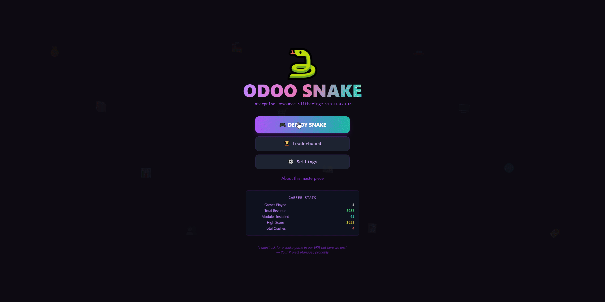

# Odoo Snake

The world's most over-engineered snake game, built entirely inside an Odoo ERP system. Created in one prompt as part of an MCP YouTube video demo, featuring 12 collectible Odoo modules, developer-themed power-ups, fake Python tracebacks, and an irresponsible amount of ERP humor.

## Features

### Gameplay
- Classic snake mechanics on a 20x20 canvas grid
- Snake with gradient purple-to-teal body and animated directional eyes
- Combo system - eat modules in quick succession for up to 1.5x score multiplier
- Score displayed as "Revenue" because KPIs matter
- Particle burst effects on module collection
- Screen shake on death
- Animated toast notifications for every install and event

### Collectible Odoo Modules (12)
Each module has a unique emoji, color, point value, and install message:

| Module | Emoji | Points | Install Message |
|--------|-------|--------|-----------------|
| CRM | :moneybag: | 10 | Pipeline is now a snake! |
| Sales | :shopping_cart: | 15 | Adding approval workflows... |
| Inventory | :package: | 12 | Counting virtual boxes... |
| Accounting | :bar_chart: | 20 | Snake is now tax-deductible! |
| HR | :busts_in_silhouette: | 8 | Snake requests time off. |
| Project | :clipboard: | 11 | 47 Kanban columns created... |
| Purchase | :label: | 14 | Budget? What budget? |
| MRP | :factory: | 18 | BOM exploded (literally). |
| Website | :globe_with_meridians: | 13 | Blog nobody will read... |
| Discuss | :envelope: | 5 | 999+ unread messages! |
| POS | :desktop_computer: | 16 | Receipt printer goes brrr... |
| Fleet | :car: | 9 | Snake has a company car! |

### Power-ups (5)
Based on actual Odoo developer commands:

- **sudo()** - Invincibility. Phase through walls and your own body. "Access rights? What access rights?"
- **cache.clear()** - Slows everything down. "Everything runs slower now."
- **UserError()** - Reverses all controls. "Controls reversed! Feature, not bug."
- **--dev=reload** - Shrinks your snake by 3 segments. "Hot reload! Lost some segments..."
- **pip install** - Doubles game speed. "Installing dependencies of dependencies..."

### Achievements (8)
ERP project milestone-themed unlockables:

- **First Deploy** - Install your first module
- **Spaghetti Code** - Reach length 20
- **Full Stack Dev** - Collect 5 unique modules in one game
- **Enterprise Edition** - Score over 200
- **Production Server** - Survive 60 seconds
- **Power User** - Collect 3 power-ups
- **Go-Live Weekend** - Reach length 40
- **Zero Bugs(TM)** - Score 500+

### Death Messages
8 fake Python tracebacks displayed on game over, including:
- `RecursionError: maximum snake depth exceeded`
- `psycopg2.OperationalError: FATAL: the snake ate itself`
- `odoo.exceptions.AccessError: you do not have permission to crash into walls`
- `MemoryError: Snake too long. Consider upgrading to Odoo Enterprise`

### Game Modes
- **Community Edition** - Standard speed. Slow but free forever
- **Enterprise Edition** - 30% faster. Costs $$$

### Speed Settings
- **Intern** (200ms) - For beginners
- **Junior** (130ms) - Default speed
- **Senior** (80ms) - Fast pace
- **CTO** (40ms) - Ludicrous speed

### Audio
- 8-bit sound effects for eating, power-ups, death, and achievements
- All sounds procedurally generated via Web Audio API (no external files)
- Toggle on/off in settings

### Visual Effects
- Canvas-rendered snake with rounded segments
- Pulsing glow on food items with module name labels
- Flashing power-up pickups with countdown timers
- Particle explosions on collection
- Golden border glow during sudo() invincibility
- Rainbow snake body during invincibility
- Optional CRT scanline overlay
- Optional grid lines
- Animated boot terminal sequence on startup
- Floating ERP emoji background on menu

### Persistent Statistics
- Career stats tracked across sessions: games played, total revenue, total modules, high score, total crashes
- Per-game stats on death screen: revenue, modules, length, uptime
- High score tracking with celebration on new records

### Leaderboard
- Server-side global leaderboard via API endpoint
- Aggregates high scores across all players from user storage
- Shows employee name, revenue, modules collected, and survival time
- Medal icons for top 3 positions
- Highlights current user's entry

## Pages

1. **Menu** - Animated terminal boot sequence, main navigation, career stats
2. **Play** - Main game canvas with HUD, combo counter, and module tracker
3. **Leaderboard** - Global score rankings from all players
4. **Settings** - Edition select, speed, visual effects, sound, achievements, danger zone reset
5. **About** - Feature list, technical stack, FAQ, and credits

## Controls

| Key | Action |
|-----|--------|
| Arrow Keys / WASD | Change direction |
| P / Escape | Pause / Resume |
| Enter / Space | Start game |

**Mobile:** Swipe to steer, tap to pause

## Import

1. Download `odoo_snake_youtube.csv` from this folder
2. In Odoo, go to **MCP Server > Web Apps** list view
3. Click the **gear icon** (Actions) and select **Import records**
4. Upload the `.csv` file and follow the import wizard

## Requirements

- [Odoo MCP Studio](https://apps.odoo.com/apps/modules/19.0/odoo_remote_mcp)
